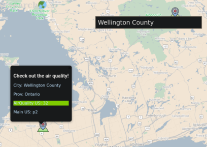

# Smoggle App



## Index
* [Project goal](#project-goal)
* [Techonolgy used](#technology-used)
* [Setup](#Setup)

## Project goal

The aim of this project is to be able to look up the air quality for various locations. To use this app just click anywhere on map to place a marker which will reveal the air quality for that location. The map is implemented using google maps API. The air quality data is pulled from [IQAir's API](https://www.iqair.com/about-iqair)

## Technology used

This application was built using HTML, CSS, Javascript. React was used to build the application as well as Google maps API. Some other APIs that were used include:
* [@reach/combobox](https://www.npmjs.com/package/@reach/combobox)
* [use-places-autocomplete](https://www.npmjs.com/package/use-places-autocomplete) 
* [@react-google-maps/api](https://www.npmjs.com/package/@react-google-maps/api)

## Setup

create .env.local in root
add in your own API KEYS using this format


```javascript
    REACT_APP_AIRVISUAL_API_KEY = "{your_API_KEY}"
    REACT_APP_GOOGLE_MAPS_API_KEY = "{your_API_KEY}"
```

To begin, clone this repo to your desktop and run 'npm install' to install dependencies.

After running 'npm install', navigate to the root folder and run 'npm start'. A browser should open and display the application.

If problems exist try installing dependencies manual using the following commands:

```javascript
npm install
npm i@reach/combobox
npm i use-places-autocomplete
npm i @react-google-maps/api
```
